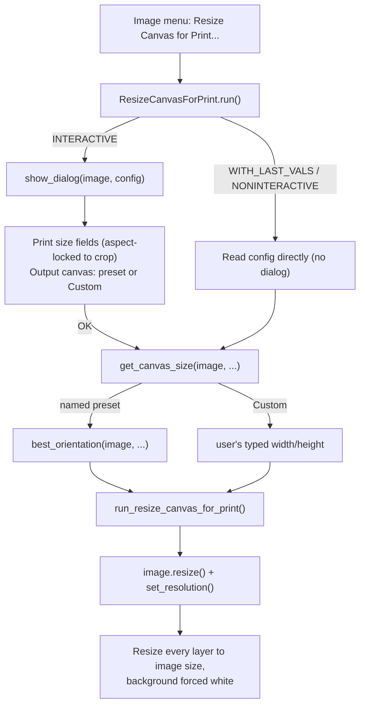

# High-Level Design: Resize Canvas for Print

## Problem

Preparing a cropped photo for a standard print size in GIMP is a repetitive manual sequence: crop, set the print resolution via Image → Print Size, then resize the canvas via Image → Canvas Size to the target paper size, choosing orientation and placement by eye each time. Getting a good result also requires manually deciding, per photo, whether to center on the crop, nudge into any extra non-destructively-cropped layer data, or accept white padding — judgment calls that are easy to get wrong under time pressure and tedious to repeat across many photos.

## Approach

A single GIMP 3.0 Python-Fu plugin, invoked from the Image menu, that collapses the manual sequence into one dialog: choose a physical print size and a target paper size (a standard preset or custom), and the plugin sets the image's resolution and resizes the canvas in one step. Two load-bearing mechanisms:

- **Content-preserving placement.** Canvas orientation and position are chosen algorithmically to minimize loss of the deliberately-cropped content, drawing on extra layer data outside the crop (from a non-destructive crop) before falling back to white padding.
- **GIMP-native persistence and UI conventions.** The dialog's last-used values are remembered via GIMP's own PDB argument/config mechanism (not custom file storage), and the dialog matches GIMP's own window and button conventions rather than inventing new ones.

## Target Users

A single user (the plugin's author) preparing personal photos for standard print sizes. No multi-user, team, or distribution concerns.

## Goals

- One dialog interaction reproduces (or improves on) the manual crop → Print Size → Canvas Size workflow.
- The canvas orientation and placement the plugin picks require no manual judgment call in the common case.
- Photo content the user deliberately cropped to is never discarded unless every orientation choice requires it.
- Dialog settings (print size, paper choice) persist between invocations, including GIMP's own Ctrl+F "repeat last filter" without reopening the dialog.

## Non-Goals

- Not a general-purpose canvas-resize tool — it exists specifically for the crop-to-print-size workflow.
- Not content-aware — no inpainting, no smart fill beyond plain white padding.
- Not built for arbitrary aspect ratios as a primary use case; Custom paper size covers that need without being the design center.
- Not multi-image batch processing — one image per invocation.

## Tenets

- **Losing deliberately-cropped content is the worst outcome.** Between discarding part of the user's crop, padding with white, and not using every available pixel of extra layer margin, discarding crop content is treated as categorically worse, not just numerically worse — every other placement trade-off is decided only once no orientation choice can avoid it.
- **Match GIMP's own conventions over inventing new ones.** Where GIMP has an established mechanism — dialog factory registration, header-bar button placement, PDB argument persistence, unit-aware size widgets — the plugin uses it rather than a custom equivalent, so it behaves like a native part of GIMP rather than a bolted-on tool.

## System Design

Single file: `resize-canvas-for-print.py`, registered as one `Gimp.ImageProcedure` (`python-fu-resize-canvas-for-print`) under `<Image>/Image`.

Components:

- **Dialog (`show_dialog`)** — a custom `GimpUi.Dialog` (not the auto-generated `GimpProcedureDialog`, which can't express the aspect-lock and conditional-visibility behavior this dialog needs). Print-size width/height fields stay locked to the current crop's aspect ratio; the output-canvas section offers named presets (4x6, 5x7, 8x10) or a Custom size. Orientation for a named preset is not decided here — it's decided once, at OK time, against whatever print size and canvas the user ends up with.
- **Placement engine (`best_orientation`, `get_canvas_size`, `placement_for_axis`)** — pure functions of the `Gimp.Image` (crop dimensions, visible-layer bounding box) plus the chosen print/paper sizes. Decides which of the two orientations of a preset fits better, and where to position the resized canvas relative to the crop and any extra layer data.
- **Persistence** — the dialog's settings (print size, which axis was last typed, paper preset, custom dimensions) are declared as real PDB procedure arguments (`add_double_argument`, etc.), so GIMP's own last-used-values mechanism handles save/restore, including driving Ctrl+F repeat-without-dialog for free.
- **Apply step (`run_resize_canvas_for_print`)** — sets the image resolution, resizes the canvas per the placement engine's decision, then resizes every layer to the new canvas size with the background color forced to white, so newly-exposed canvas area is opaque white rather than transparent (matching what the equivalent manual "Canvas Size → Resize layers: All" produces).

## Key Design Decisions

- **Orientation is decided by a hard content-loss gate, then a weighted cost.** Full algorithm and rejected alternatives: Orientation & Placement LLD.
- **Settings persist via declared PDB arguments and GIMP's `ProcedureConfig`.** Details and rejected alternatives: Dialog & Persistence LLD.
- **Only the last-edited print-size axis is remembered.** Details and rejected alternatives: Dialog & Persistence LLD.
- **Layers are resized to the new canvas size with a forced-white background.** Details and rejected alternatives: Dialog & Persistence LLD.

## Success Metrics

Running the plugin on a freshly cropped photo produces a result at least as good as the equivalent manual crop → Print Size → Canvas Size sequence would have, without the user needing to judge orientation or placement by eye. Regression signal: any case where the plugin discards crop content that a manual pass, or a different orientation choice, would have kept.

## References

- Supersedes the manual GIMP workflow: crop → Image → Print Size → Image → Canvas Size (with "Resize layers: All").
- GIMP 3.0 Python-Fu plugin API, `GimpUi` widget set (`GimpUi.Dialog`, `Gimp.ProcedureConfig`), verified against bundled example plugins (`foggify.py`, `goat-exercise-py3.py`, `spyro-plus.py`) and GObject Introspection where official Python-specific docs don't exist.
